# xsoarpalo 🏦🔶🔐
xsoarpalo : Phishing Incident Response Automation # Cortex XSOAR # Palo Alto Networks # SOAR

## Objective
- Investigating incidents using Cortex XSOAR.
  - Real spear phishing attack against Galactic Ministry of Finance (fictional bank), by infiltrating the bank's e-mail server. After infiltration, the attacker sends phishing e-mails to executives at a partnering bank, Bordeaux Bank, during peak business hours.
- Understanding Cortex XSOAR War Rooms.
- Creating an incident Response Plan with Cortex XSOAR.

## Galactic Ministry Bank Security Orchestration, Automation & Response (SOAR)

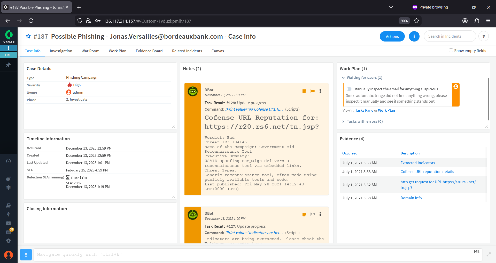

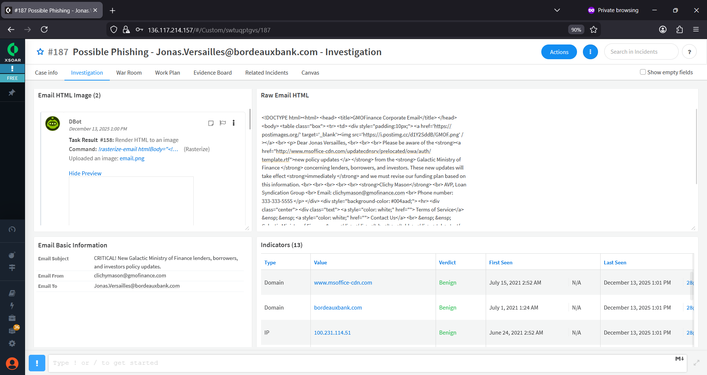

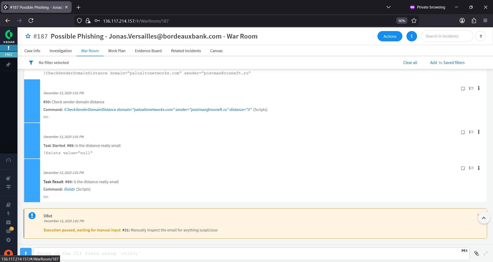

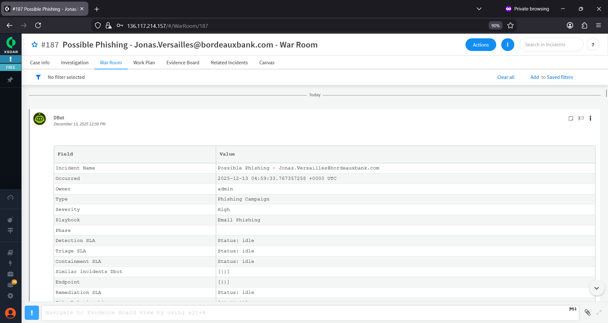

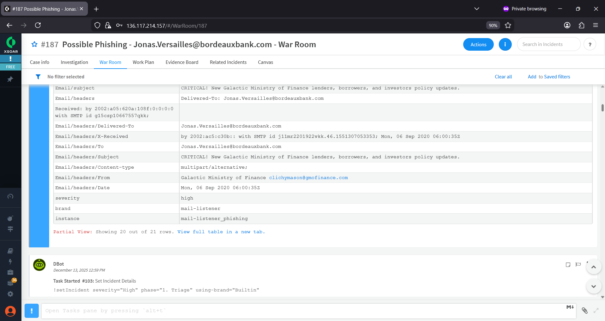

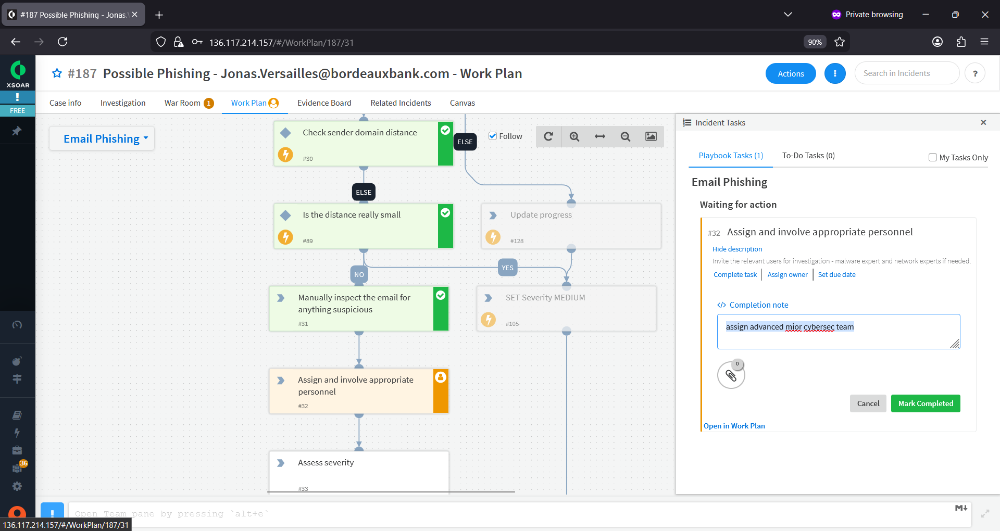

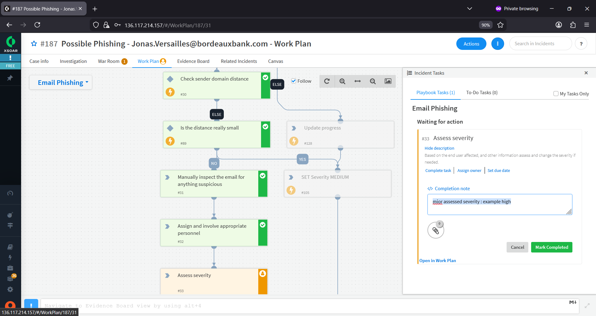

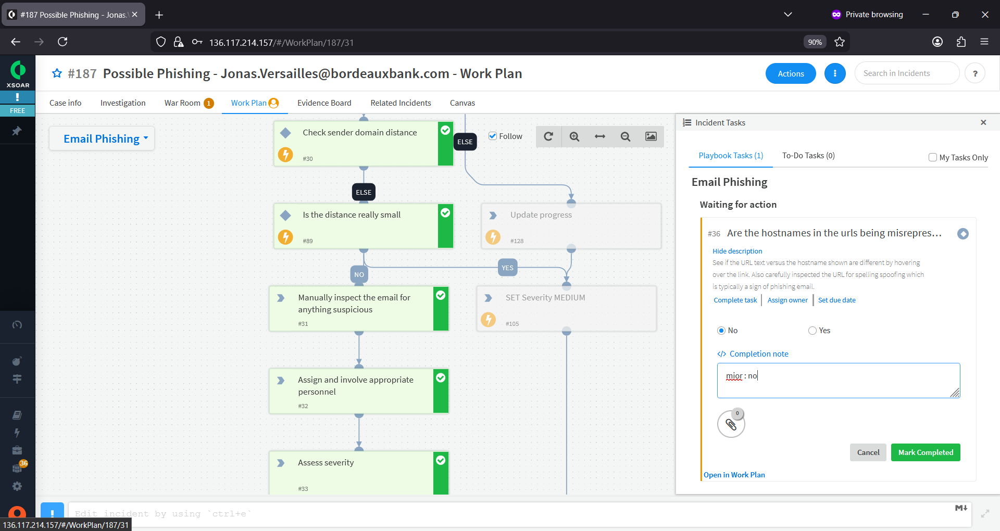

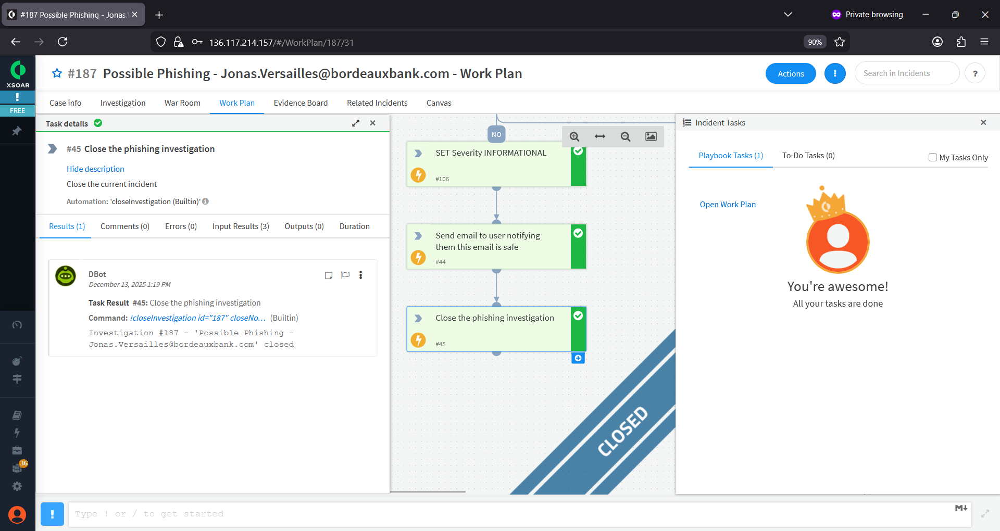

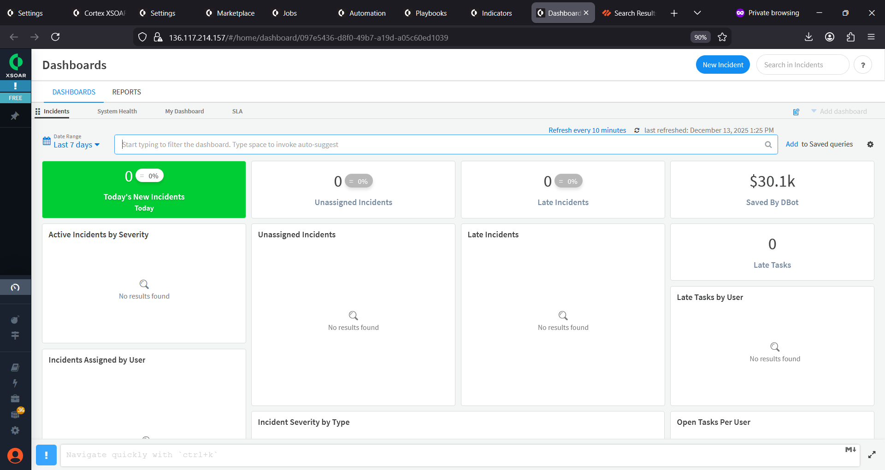

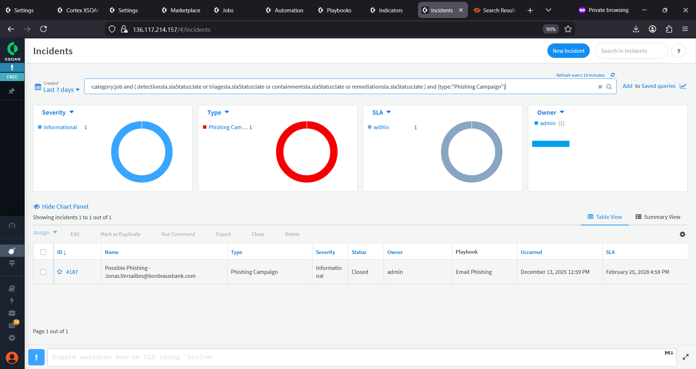

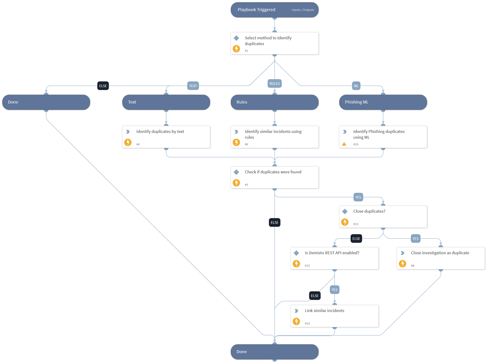
